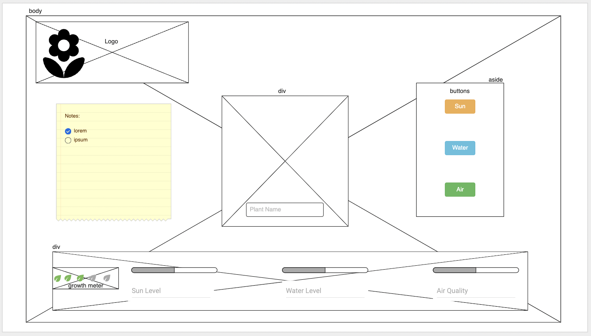

# Windowsill
Digital plant parent experience.

## TOC:

- [User Stories](#user-stories)
- [Wireframes](#wireframes)

## User Stories
A Windowsill user is someone who wants to relive the 90's Tomagotchi experience through taking care of and raising a digital pet plant so that they can feel like they have a green thumb even if they don't.

#### Baseline User can:
- name the plant
- water the plant so it doesn't die of thirst
- open the blinds to let your plant get sunlight for photosynthesis
- open the window for fresh air and watch it sway in the wind
- watch the plant grow bigger every leaf it accumulates in the Growth Tracker until it reaches full materity of 4 leaves in the tracker.

#### Opportunities to advance the user experience further:
- purchase more plants
- fertilize plants to grow more flowers
- turn on GroLight for faster growth
- mist plants to let plants shine
- propogate or plant new seeds

## Wireframes

